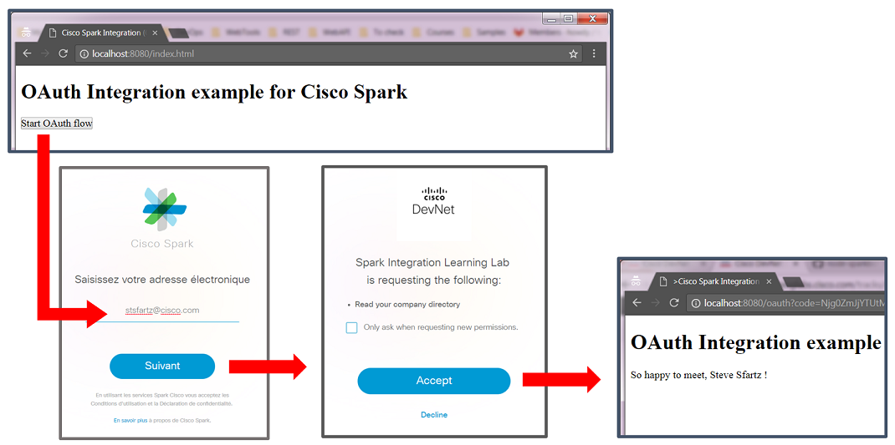
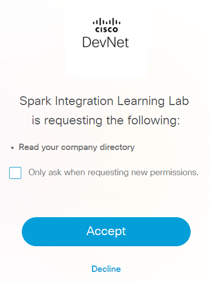
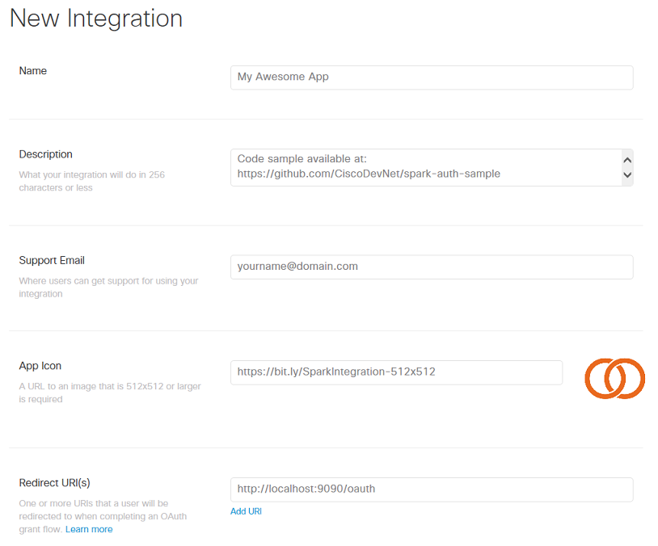
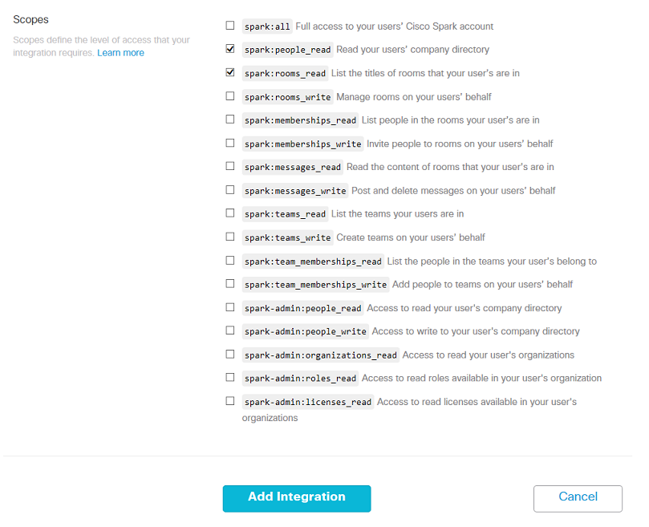
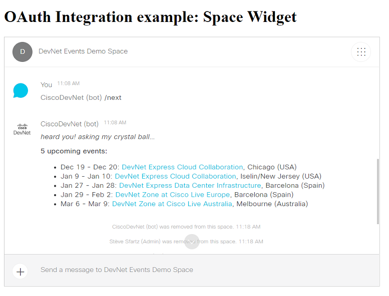

# Example of Webex Integration (OAuth flow) in Node.js

This Webex Integration example illustrates an OAuth Grant flow at the end of which the Webex Teams user who granted permission will see his fullname displayed.

This code sample comes as a companion to the DevNet learning lab: [Run a Cisco Spark Integration locally](https://learninglabs.cisco.com/tracks/collab-cloud/spark-apps/collab-spark-intl/step/1).




This example leverages a pre-registered Webex OAuth Integration with a Redirect URL on localhost so that it can be run with minimal setup.
The flow initiates at http://localhost:8080/, and the provided Webex Application's Oauth Flow redirects to http://localhost:8080/oauth

For production purpose, you will register and deploy the integration on a public URL. Please check the guide to [register your own integration](#https://github.com/CiscoDevNet/spark-integration-sample#to-register-your-own-spark-oauth-integration).


## Run the sample locally

``` bash
git clone https://github.com/CiscoDevNet/webex-integration-sample
cd webex-integration-sample
npm install
DEBUG=oauth* node server.js
```

You're all set, the integration sample is live! 
Let's go through the OAuth flow.

Reach to the integration home page from a Web browser: open [http://localhost:8080](http://localhost:8080):


Click Start, enter your Webex Teams email and click accept (or decline):




If you accepted, the integration you're running locally just got issued a "Webex Teams API access token" so that the code sample can now act on your behalf, and with the set of permissions you provided.
The integration custom code logic uses the provided token to request your Webex Teams account details (GET /people/me) and displays your full name.


## Registering your own OAuth Integration

To learn more about Webex Integrations, [read the reference documentation](https://developer.webex.com/authentication.html).

In the example above, we were running a pre-registered OAuth integration running on port 8080.
Let's now register a new Webex integration that we will be running on port **9090**.

Go to the [Webex for developers](https://developer.webex.com) portal, click 'Apps', 'add Apps', and then [create an integration](https://developer.webex.com/add-integration.html).

Fill the form fields:
- **Name**: your app name, such as 'My Awesome App' in the snapshot below,
- **Description**: these details are not displayed to your app end-users,
- **Support email**: a valid email address for Webex Spark operations team to reach to you if necessary,
- **App Icon**: a 512x512 file or simply pick one of the default icons. Feel free to use this provided sample for now: [https://bit.ly/SparkIntegration-512x512](https://bit.ly/SparkIntegration-512x512)
- **Redirect URI**: enter `http://localhost:9090/oauth` since this is the URL at which the provided code sample will be listening on your local machine. More to come in the next steps if this lab
- **Scopes**: select the `spark:people_read` and `spark:rooms_read` scopes.




> Note the list of scopes you selected corresponds to the maximum set of scopes that your integration will be entitled to ask for. However, from code, your integration can dynamically [refine the set of scopes asked for](https://github.com/CiscoDevNet/webex-integration-sample/blob/master/server.js#L30) in order to comply with the real needs of your application. A good practice is to start small and extend the set of scopes asked for as the end-users gain trust in your app and is ready to ask more advanced features.




Click save, and look for your integration `client id` and `client secret`.


Let's now configure the integration: you can either paste your integration client id and secret into [the code](https://github.com/CiscoDevNet/webex-integration-sample/blob/master/server.js#L26), or set these as env variables on the command line.

Instructions for **Mac, Linux and Windows bash users** 
- open a terminal
- on a single command line, type:

    ```shell
    DEBUG=oauth* PORT=9090 REDIRECT_URI="http://localhost:9090/oauth" CLIENT_ID="YOUR_INTEGRATION_ID" CLIENT_SECRET="YOUR_INTEGRATION_SECRET"  node server.js
    ```

Instructions for **Windows command shell users**
- open a command shell
- enter the commands below:

    ```shell
    set DEBUG="oauth*"
    set PORT=9090
    set REDIRECT_URI="http://localhost:9090/oauth"
    set CLIENT_ID="YOUR_INTEGRATION_ID"
    set CLIENT_SECRET="YOUR_INTEGRATION_SECRET"
    node server.js
    ```

**You're all set. Restart your integration, and give it a try: [http://localhost:9090](http://localhost:9090)**


This step by step guide explained how to register a Webex Integration running on a local developer environment.
In the real-world, you will want to deploy your integration, and register its public URL rather than your local machine's.
Check the DevNet learning lab: ['Deploy a Webex OAuth Integration'](https://learninglabs.cisco.com/tracks/devnet-express-cloud-collab-soft-dev/creating-spark-integrations-sd/collab-spark-intd-heroku/step/1) for detailled instructions.


## Integrating with Webex Teams Widgets

Now that you know the basics about Webex Integrations, you can leverage not only REST API Resources but also the full set of Webex Teams SDKs and Widgets.

To experiment with the Webex Teams Widget, simply launch the `widget.js` sample with 2 environment variables:
- BOT_TOKEN: place the token of a bot
- SPACE_ID: place the identifer of a Space that the bot is part of

Once granted authorization to open the widget, the sample will add the user to a demo space, and display the 'Space' Widget. 

_Note that the OAuth list of scopes has been changed to `spark:all` as required by the 'Space' Widget. To successfully run this sample, open the [Webex for Developers](https://developer.webex.com) portal, and change the list of scopes that can be requested by your OAuth Integration to **spark:all**_

```
BOT_TOKEN=<your-token> SPACE_ID=<demo-space> node widget.js
```




## More about Webex Integrations

By creating custom Webex Apps, developers can tie together existing software with Webex, and instantly promote their Apps. 
For example, add the ["Jira Integration"](https://depot.ciscospark.com/integrations/Y2lzY29zcGFyazovL3VzL0FQUExJQ0FUSU9OLzQwYjk2ZTQzLTZkNmQtNDJjZS1iODk0LWU0MmVhNWJjMDJmNA) to existing Teams spaces, and your teams will be notified as Jira issues (whether EPIC, Story, Task or Bugs) are updated.

Webex Integrations are a way for your apps to request permission to invoke the Webex APIs on behalf of Webex Teams users. 
The process used to request permission is called an OAuth Grant Flow, and is documented in the [Integrations guide](https://developer.webex.com/authentication.html).

You can experiment the flow in DevNet Learning lab ["Understand the OAuth Grant flow of Webex Teams Integrations"](https://learninglabs.cisco.com/tracks/collab-cloud/business-messaging/collab-spark-auth/step/1).
